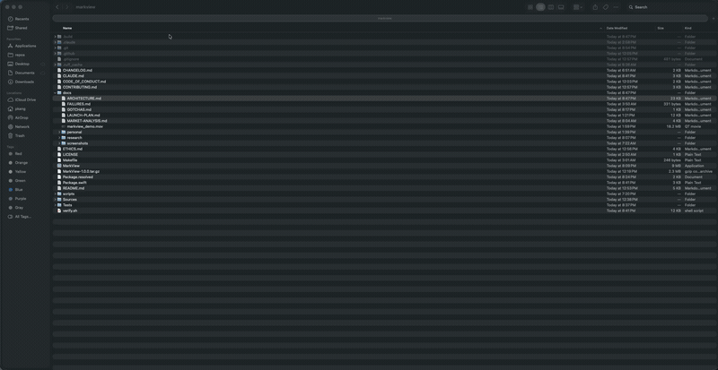
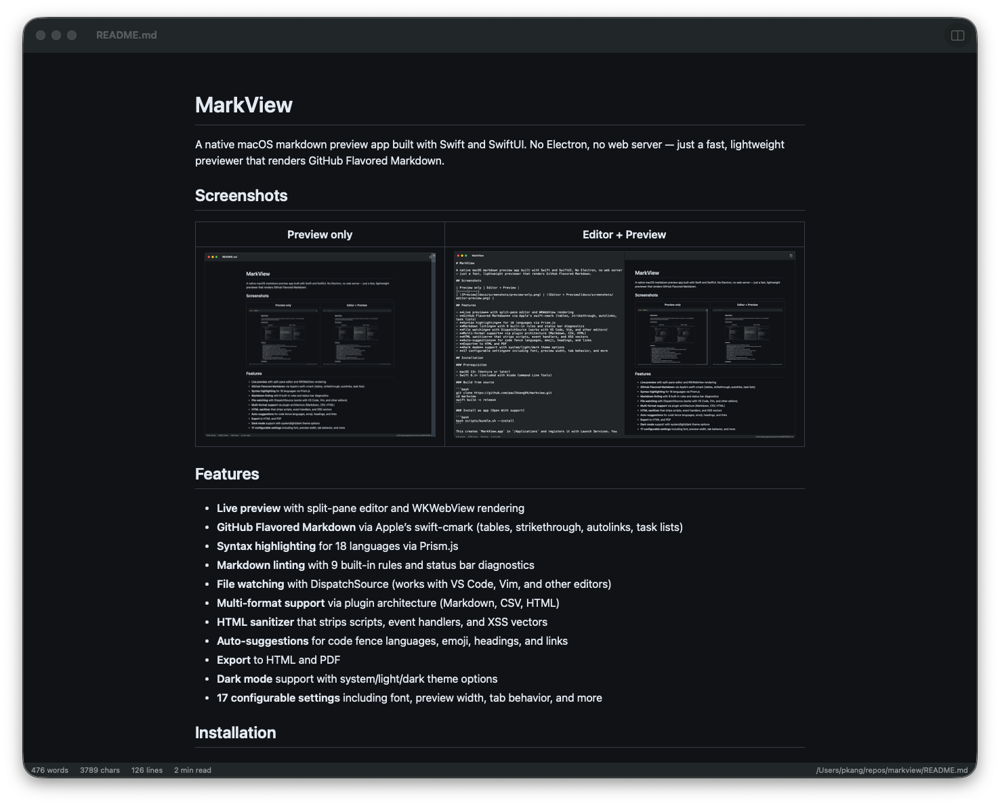
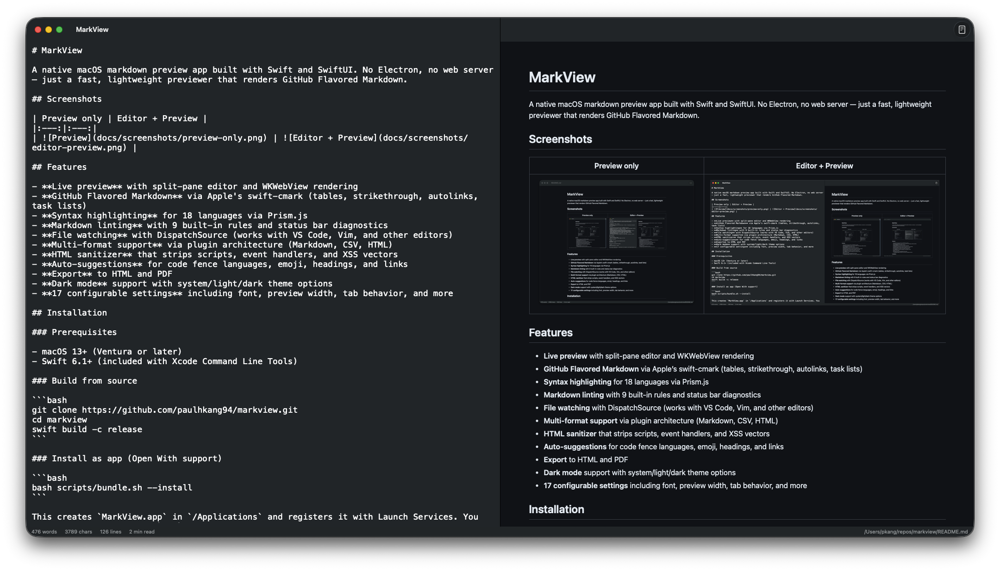

# MarkView

A native macOS markdown preview app built with Swift and SwiftUI. No Electron, no web server — just a fast, lightweight previewer that renders GitHub Flavored Markdown.

## Demo



## Screenshots

| Preview only | Editor + Preview |
|:---:|:---:|
|  |  |

## Features

- **Live preview** with split-pane editor and WKWebView rendering
- **GitHub Flavored Markdown** via Apple's swift-cmark (tables, strikethrough, autolinks, task lists)
- **Syntax highlighting** for 18 languages via Prism.js
- **Markdown linting** with 9 built-in rules and status bar diagnostics
- **File watching** with DispatchSource (works with VS Code, Vim, and other editors)
- **Multi-format support** via plugin architecture (Markdown, CSV, HTML)
- **HTML sanitizer** that strips scripts, event handlers, and XSS vectors
- **Auto-suggestions** for code fence languages, emoji, headings, and links
- **Export** to HTML and PDF
- **Dark mode** support with system/light/dark theme options
- **17 configurable settings** including font, preview width, tab behavior, and more

## Installation

### Homebrew (recommended)

```bash
# Full .app with Quick Look extension
brew install --cask paulhkang94/markview/markview

# CLI only (builds from source)
brew tap paulhkang94/markview
brew install markview
```

**Note:** If macOS shows _"MarkView.app is damaged and can't be opened"_ after installing via Homebrew, run:
```bash
xattr -d com.apple.quarantine /Applications/MarkView.app
```
This happens because the app is not yet Apple-notarized. The Homebrew cask handles this automatically on newer versions.

### Build from source

**Prerequisites:** macOS 13+, Swift 6.1+ (included with Xcode Command Line Tools)

```bash
git clone https://github.com/paulhkang94/markview.git
cd markview
swift build -c release
```

### Install as app (Open With support)

```bash
bash scripts/bundle.sh --install
```

This creates `MarkView.app` in `/Applications` and registers it with Launch Services. You can then right-click any `.md` file in Finder and choose **Open With > MarkView**.

### Install CLI commands

```bash
bash scripts/install-cli.sh
```

This creates `mdpreview` and `md` symlinks in `~/.local/bin/`. Note: if `md` is aliased in your shell (e.g., to `mkdir`), use `mdpreview` instead.

## Usage

### CLI

```bash
mdpreview README.md       # Open a file
mdpreview                 # Open empty editor
```

### Finder

Right-click any `.md`, `.markdown`, `.mdown`, `.mkd` file > **Open With** > **MarkView**

### Programmatic

```bash
open -a MarkView README.md
```

## MCP Server (AI Integration)

MarkView includes an MCP (Model Context Protocol) server for AI-powered workflows. It lets AI assistants like Claude preview markdown files directly in MarkView.

### Tools

| Tool | Description |
|------|-------------|
| `preview_markdown` | Write content to a temp file and open it in MarkView |
| `open_file` | Open an existing `.md` file in MarkView |

### Claude Desktop Setup

Add to `~/Library/Application Support/Claude/claude_desktop_config.json`:

```json
{
  "mcpServers": {
    "markview": {
      "command": "/Applications/MarkView.app/Contents/MacOS/markview-mcp-server"
    }
  }
}
```

### Test the MCP server

```bash
bash scripts/test-mcp.sh
```

## Architecture

```
Sources/MarkViewCore/           # Library (no UI, fully testable)
  MarkdownRenderer.swift        # cmark-gfm C API wrapper
  FileWatcher.swift             # DispatchSource file monitoring
  MarkdownLinter.swift          # 9-rule pure Swift linting engine
  MarkdownSuggestions.swift     # Auto-suggest engine
  LanguagePlugin.swift          # Plugin protocol + registry
  HTMLSanitizer.swift           # XSS prevention
  Plugins/                      # CSV, HTML, Markdown plugins

Sources/MarkView/               # SwiftUI app (macOS 13+)
  ContentView.swift             # Split-pane editor + preview
  WebPreviewView.swift          # WKWebView with Prism.js
  Settings.swift                # 17 settings with theme/width/font enums
  ExportManager.swift           # HTML/PDF export

Sources/MarkViewMCPServer/      # MCP server for AI tool integration
  main.swift                    # stdio JSON-RPC server (preview_markdown, open_file)

Tests/TestRunner/               # 178 standalone tests (no XCTest)
Tests/VisualTester/             # 19 visual regression tests + WCAG contrast
Tests/FuzzTester/               # 10K random input crash testing
Tests/DiffTester/               # Differential testing vs cmark-gfm CLI
scripts/test-mcp.sh             # 29 MCP protocol + integration tests
```

See [docs/ARCHITECTURE.md](docs/ARCHITECTURE.md) for full details.

## Testing

```bash
# Run all tests (276 tests)
swift run MarkViewTestRunner

# Full verification (build + tests)
bash verify.sh

# Extended (fuzz + differential)
bash verify.sh --extended
```

## Development

```bash
swift build                          # Build all targets
swift run MarkView                   # Launch app
swift run MarkView /path/to/file.md  # Launch with file
swift run MarkViewTestRunner         # Run tests
```

## Support

If MarkView is useful to you, consider supporting development:

- [GitHub Sponsors](https://github.com/sponsors/paulhkang94)
- Star this repo to help others find it

## License

MIT — see [LICENSE](LICENSE).
