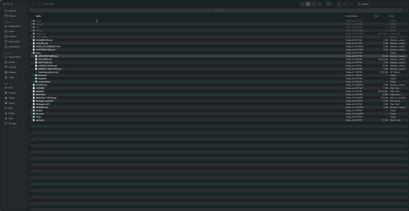

# MarkView

[](https://github.com/paulhkang94/markview/releases/latest)
[&color=green)](https://www.npmjs.com/package/mcp-server-markview)
[](https://glama.ai/mcp/servers/@paulhkang94/markview)

Native macOS markdown preview with MCP server for Claude Code. Claude writes markdown — MarkView renders it live, in a real native window, while you work.

> **Versions:** The macOS app (`app` badge) and the npm MCP wrapper (`npm` badge) are versioned independently. App releases happen when the Swift binary changes; npm patches happen for MCP server improvements. Both badges always show the latest of each.



| Preview only | Editor + Preview |
|:---:|:---:|
|  |  |

## Quick Start — Claude Code

One command to wire MarkView into every Claude Code session:

```bash
claude mcp add --transport stdio --scope user markview -- npx mcp-server-markview
```

That's it. Claude can now call `preview_markdown` to render any markdown string in a native macOS window, or `open_file` to open any `.md` file directly.

| Tool | What it does |
|------|-------------|
| `preview_markdown` | Render markdown content in a live-reloading MarkView window |
| `open_file` | Open an existing `.md` file in MarkView |

### Claude Desktop Setup

Add to `~/Library/Application Support/Claude/claude_desktop_config.json`:

```json
{
  "mcpServers": {
    "markview": {
      "command": "npx",
      "args": ["mcp-server-markview"]
    }
  }
}
```

> **Note:** MCP servers belong in `~/.claude.json` (Claude Code) or `claude_desktop_config.json` (Claude Desktop), not `~/.claude/settings.json`.

## Installation

### Homebrew (recommended)

```bash
# Full .app with Quick Look extension — Apple notarized, Gatekeeper approved
brew install --cask paulhkang94/markview/markview

# CLI only (builds from source)
brew tap paulhkang94/markview
brew install markview
```

### Build from source

**Prerequisites:** macOS 14+, Swift 6.0+ (Xcode Command Line Tools)

```bash
git clone https://github.com/paulhkang94/markview.git
cd markview
swift build -c release
```

### Install as app (Open With support)

```bash
bash scripts/bundle.sh --install
```

Creates `MarkView.app` in `/Applications` and registers it with Launch Services for right-click > Open With in Finder.

### Install CLI

```bash
bash scripts/install-cli.sh
```

Creates `mdpreview` and `md` symlinks in `~/.local/bin/`.

## Usage

### CLI

```bash
mdpreview README.md       # Open a file
mdpreview                 # Open empty editor
```

### Finder

Right-click any `.md`, `.markdown`, `.mdown`, `.mkd` file > **Open With** > **MarkView**

### Programmatic

```bash
open -a MarkView README.md
```

## Features

- **GitHub Flavored Markdown** via swift-cmark (tables, strikethrough, autolinks, task lists, footnotes)
- **Mermaid diagrams** — flowcharts, sequence, Gantt, ER, and pie charts
- **Syntax highlighting** via Prism.js (18 languages)
- **Quick Look integration** — spacebar-preview `.md` files in Finder without opening the app
- **Markdown linting** with 9 built-in rules and status bar diagnostics
- **Live split-pane editor** with WKWebView rendering and bidirectional scroll sync
- **File watching** with DispatchSource — works with VS Code, Vim, and other editors
- **Local image rendering** — inlines relative paths like `` correctly
- **Export** to HTML and PDF
- **HTML sanitizer** — strips scripts, event handlers, and XSS vectors
- **Drag and drop** — drop any `.md` file onto the window to open
- **Find & Replace** — Cmd+F / Cmd+Option+F
- **Format on save** — auto-applies lint fixes
- **Auto-save**, **word count**, **line numbers**, **scroll position preservation**
- **Dark mode** — system/light/dark theme options, 18 configurable settings

## Architecture

```
Sources/MarkViewCore/           # Library (no UI, fully testable)
  MarkdownRenderer.swift        # cmark-gfm C API wrapper
  FileWatcher.swift             # DispatchSource file monitoring
  MarkdownLinter.swift          # 9-rule pure Swift linting engine
  HTMLSanitizer.swift           # XSS prevention
  LanguagePlugin.swift          # Plugin protocol + registry
  Plugins/                      # CSV, HTML, Markdown plugins

Sources/MarkView/               # SwiftUI app (macOS 14+)
  ContentView.swift             # Split-pane editor + preview
  WebPreviewView.swift          # WKWebView with Prism.js
  ExportManager.swift           # HTML/PDF export

Sources/MarkViewMCPServer/      # MCP server for AI tool integration
  main.swift                    # stdio JSON-RPC (preview_markdown, open_file)

Tests/TestRunner/               # 403 standalone tests (no XCTest)
Tests/VisualTester/             # 5 visual regression tests + WCAG contrast
Tests/FuzzTester/               # 10K random input crash testing
Tests/DiffTester/               # Differential testing vs cmark-gfm CLI
```

See [docs/ARCHITECTURE.md](docs/ARCHITECTURE.md) for full details.

## Testing

```bash
swift run MarkViewTestRunner    # 403 tests
bash verify.sh                  # Full verification (build + tests)
bash verify.sh --extended       # + fuzz + differential
bash scripts/test-mcp.sh        # MCP protocol tests
```

## Development

```bash
swift build
swift run MarkView
swift run MarkView /path/to/file.md
```

## Support

- [GitHub Sponsors](https://github.com/sponsors/paulhkang94)
- Star this repo to help others find it

## License

MIT — see [LICENSE](LICENSE).
