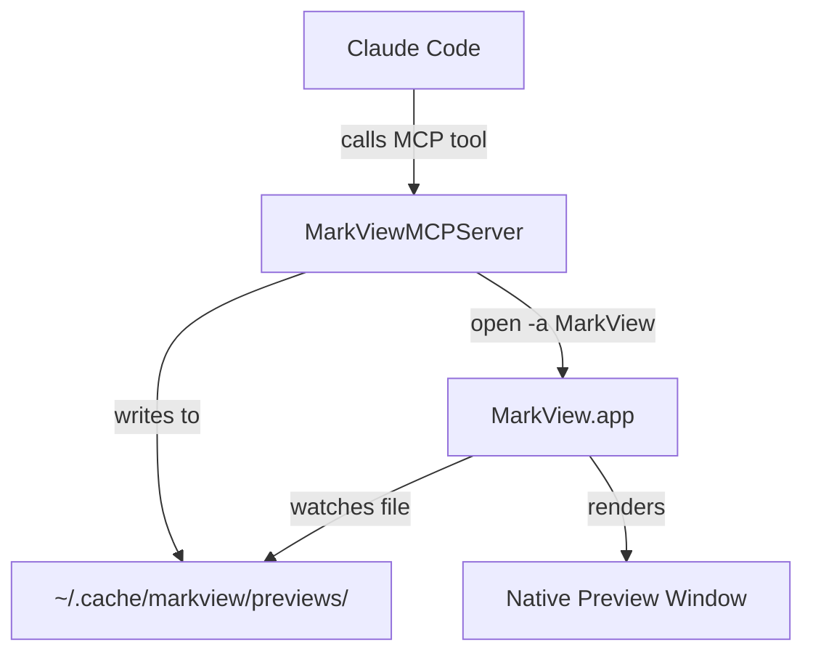
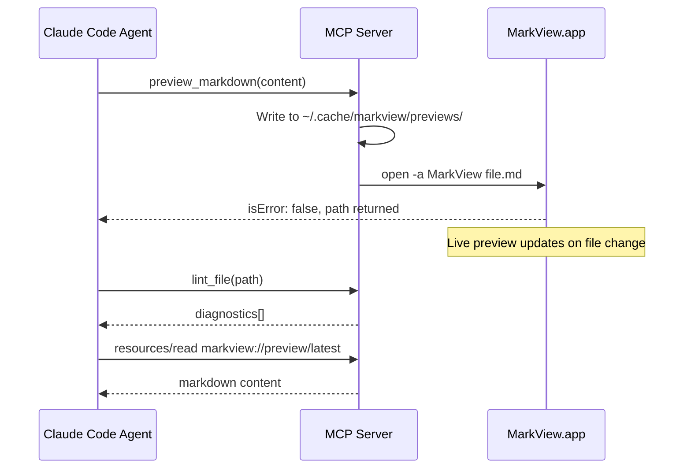
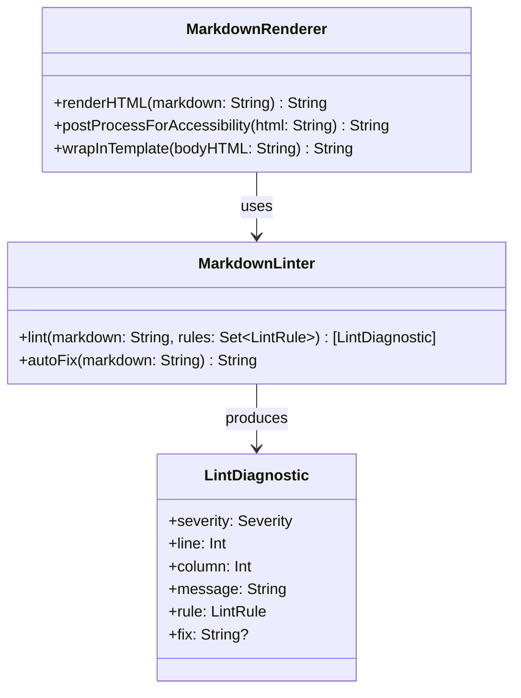
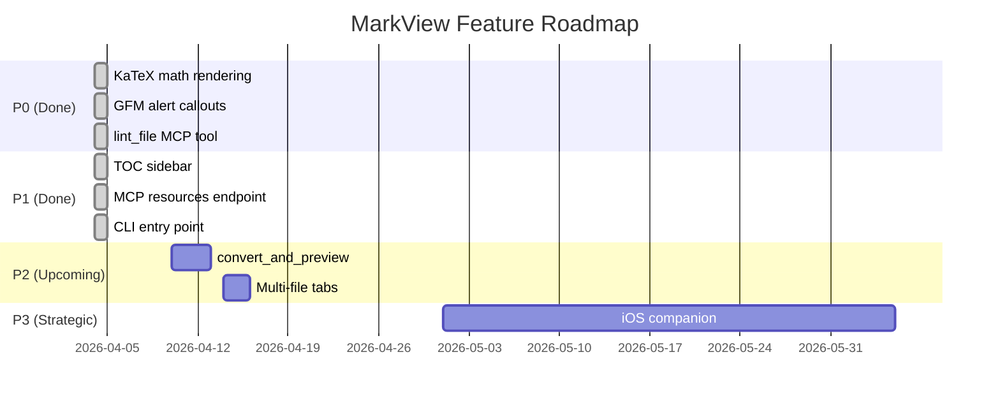
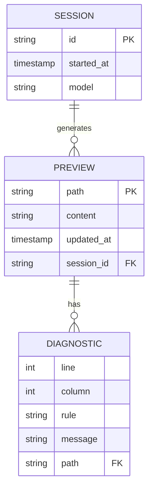
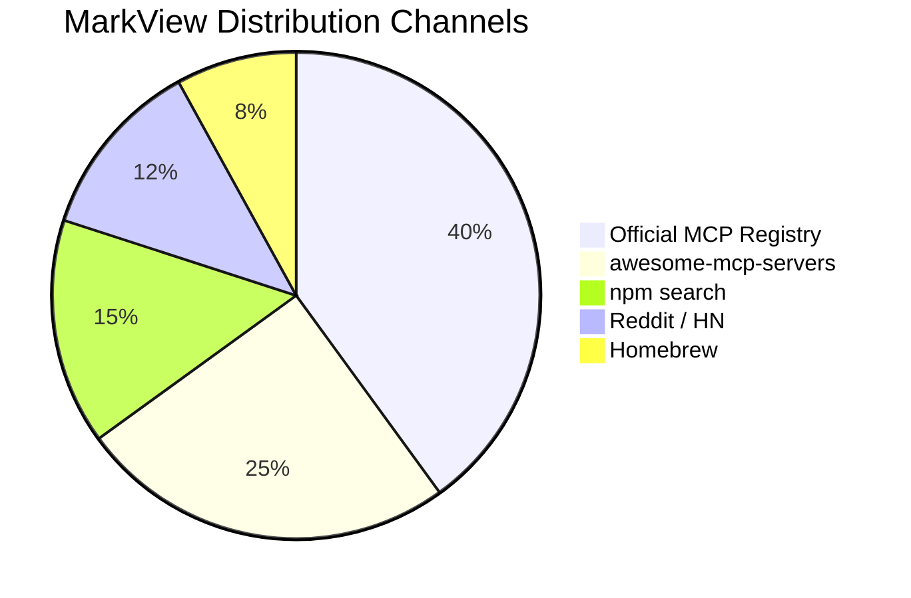
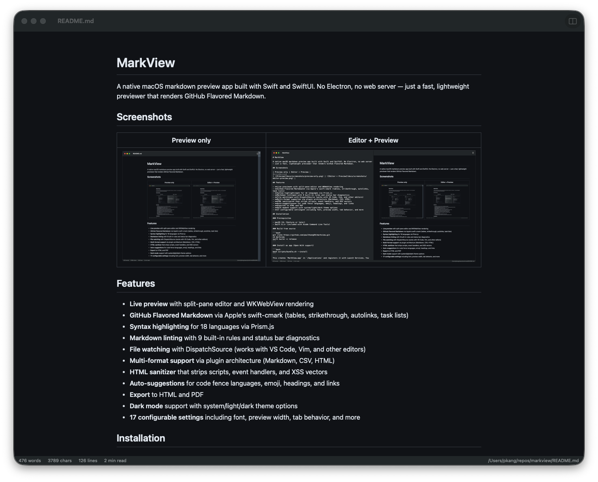
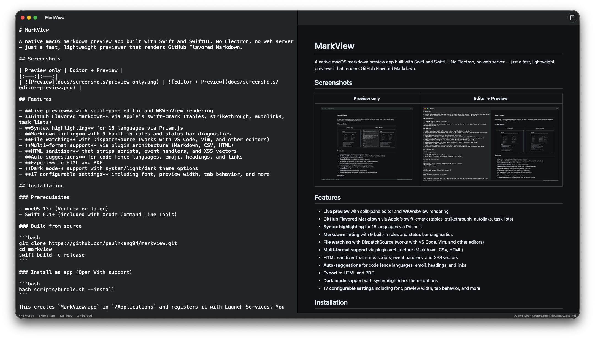

# MarkView Golden Corpus

A comprehensive fixture exercising every rendering feature MarkView supports.
Used for visual QA, regression testing, and demo purposes.

---

## 1. Typography

Regular paragraph with **bold**, *italic*, ***bold italic***, ~~strikethrough~~,
`inline code`, and [a link](https://github.com/paulhkang94/markview).

Paragraph with an auto-link: https://github.com/paulhkang94/markview

Smart quotes: "Hello world" and 'single quotes' — em dash, ... ellipsis.

---

## 2. Headings

# H1 Heading
## H2 Heading
### H3 Heading
#### H4 Heading
##### H5 Heading
###### H6 Heading

---

## 3. GFM Tables

| Feature | Status | Notes |
|---------|:------:|------:|
| GFM Tables | ✅ | Right-aligned column |
| Strikethrough | ✅ | `~~text~~` |
| Task Lists | ✅ | `- [ ]` / `- [x]` |
| Autolinks | ✅ | Bare URLs |
| Footnotes | ✅ | `[^1]` |
| Math (KaTeX) | ✅ | `$...$` and `$$...$$` |
| Mermaid | ✅ | Fenced code blocks |
| GFM Alerts | ✅ | `> [!NOTE]` |

Wide table (tests horizontal scroll):

| Col 1 | Col 2 | Col 3 | Col 4 | Col 5 | Col 6 | Col 7 | Col 8 | Col 9 | Col 10 |
|-------|-------|-------|-------|-------|-------|-------|-------|-------|--------|
| A     | B     | C     | D     | E     | F     | G     | H     | I     | J      |
| 1     | 2     | 3     | 4     | 5     | 6     | 7     | 8     | 9     | 10     |

---

## 4. Task Lists

- [x] KaTeX math rendering
- [x] GFM alert callouts
- [x] `lint_file` MCP tool
- [x] TOC sidebar
- [x] MCP resources endpoint
- [ ] iOS companion app
- [ ] Multi-file tabs

---

## 5. Code Blocks

### Swift

```swift
import Foundation
import MCP

@main struct MarkViewMCPServer {
    static func main() async throws {
        let server = Server(name: "markview", version: "1.2.6",
                            capabilities: .init(tools: .init(listChanged: false)))
        let transport = StdioTransport()
        try await server.start(transport: transport)
        await server.waitUntilCompleted()
    }
}
```

### Python

```python
import subprocess, json

def call_mcp_tool(tool: str, args: dict) -> dict:
    req = {"jsonrpc": "2.0", "id": 1, "method": "tools/call",
           "params": {"name": tool, "arguments": args}}
    proc = subprocess.Popen(["npx", "-y", "mcp-server-markview"],
                            stdin=subprocess.PIPE, stdout=subprocess.PIPE)
    out, _ = proc.communicate(json.dumps(req).encode())
    return json.loads(out)
```

### TypeScript

```typescript
import { MCPClient } from "@modelcontextprotocol/sdk";

const client = new MCPClient();
await client.connect({ command: "npx", args: ["-y", "mcp-server-markview"] });
const result = await client.callTool("preview_markdown", {
  content: "# Hello\n\nRendered by MarkView.",
});
```

### Bash

```bash
#!/bin/bash
# Install MarkView MCP server in Claude Code
claude mcp add --transport stdio --scope user markview -- npx mcp-server-markview
echo "✓ MarkView MCP server registered"
```

### JSON

```json
{
  "mcpServers": {
    "markview": {
      "command": "npx",
      "args": ["-y", "mcp-server-markview"]
    }
  }
}
```

### Inline code

Use `preview_markdown(content)` to preview, `open_file(path)` to open, and
`lint_file(path)` to lint. The MCP server runs via `npx -y mcp-server-markview`.

---

## 6. Math (KaTeX)

### Inline math

Einstein's equation: $E = mc^2$

Quadratic formula: $x = \frac{-b \pm \sqrt{b^2 - 4ac}}{2a}$

Euler's identity: $e^{i\pi} + 1 = 0$

### Display math

Gaussian integral:

$$\int_{-\infty}^{\infty} e^{-x^2} dx = \sqrt{\pi}$$

Fourier transform:

$$\hat{f}(\xi) = \int_{-\infty}^{\infty} f(x)\, e^{-2\pi i x \xi}\, dx$$

Maxwell's equations (differential form):

$$\nabla \cdot \mathbf{E} = \frac{\rho}{\varepsilon_0}$$

$$\nabla \times \mathbf{B} = \mu_0 \mathbf{J} + \mu_0\varepsilon_0 \frac{\partial \mathbf{E}}{\partial t}$$

### LaTeX delimiters

Using `\(...\)` for inline: \(a^2 + b^2 = c^2\)

Using `\[...\]` for display:

\[
  \sum_{n=1}^{\infty} \frac{1}{n^2} = \frac{\pi^2}{6}
\]

---

## 7. Mermaid Diagrams

### Flowchart



### Sequence Diagram



### Class Diagram



### Gantt Chart



### ER Diagram



### Pie Chart



---

## 8. GFM Alerts

> [!NOTE]
> MarkView requires macOS 14+. Install via Homebrew:
> `brew install --cask paulhkang94/markview/markview`

> [!TIP]
> Add MarkView to Claude Code in one line:
> `claude mcp add --transport stdio --scope user markview -- npx mcp-server-markview`

> [!IMPORTANT]
> The MCP server exposes three tools: `preview_markdown`, `open_file`, and `lint_file`.
> All three work without a network connection — MarkView is fully offline-capable.

> [!WARNING]
> `open_file` requires an absolute path. Relative paths will return an error.
> Use `realpath file.md` to resolve before passing to the tool.

> [!CAUTION]
> Do not call MCP tools from subagents — MCP requires the main conversation context.
> Always invoke `preview_markdown` from the top-level Claude Code session.

---

## 9. Blockquotes (regular)

> "The best markdown previewer is the one that AI agents can call directly."
>
> Nested blockquote:
> > Inner quote with **bold** and `code`.

---

## 10. Lists

### Unordered

- First item
- Second item
  - Nested item
  - Another nested item
    - Deeply nested
- Third item with a [link](https://github.com/paulhkang94/markview)

### Ordered

1. Install MarkView
2. Add to Claude Code
   1. Run the `claude mcp add` command
   2. Verify with `claude mcp list`
3. Use in your workflow

### Definition-style (using bold)

**preview_markdown** — Renders markdown content in a native macOS window. Writes to
`~/.cache/markview/previews/`.

**open_file** — Opens an existing `.md` file in MarkView for live preview.

**lint_file** — Lints a markdown file against 9 built-in rules and returns
line-by-line diagnostics.

---

## 11. Images



Image with title:



---

## 12. Footnotes

MarkView supports GitHub Flavored Markdown[^gfm], Mermaid diagrams[^mermaid],
and KaTeX math rendering[^katex].

[^gfm]: GitHub Flavored Markdown extends CommonMark with tables, task lists, strikethrough, and autolinks.
[^mermaid]: Mermaid is a JavaScript-based diagramming tool. MarkView bundles the renderer offline.
[^katex]: KaTeX renders math using MathML output — no font files required.

---

## 13. HTML (sanitized passthrough)

<details>
<summary>Click to expand: MCP setup details</summary>

MarkView's MCP server communicates via **stdio JSON-RPC** (MCP 2024-11-05 protocol).

```json
{"jsonrpc":"2.0","method":"tools/list","id":1,"params":{}}
```

</details>

<kbd>⌘</kbd>+<kbd>Shift</kbd>+<kbd>P</kbd> opens the command palette.

---

## 14. Horizontal Rules

---

***

___

---

## 15. Escape Characters

\*not italic\* \`not code\` \[not a link\] \# not a heading

---

## 16. Unicode and Emoji

日本語テスト: マークビュー（MarkView）はネイティブmacOSアプリです。

中文测试: MarkView 是原生 macOS Markdown 预览器。

한국어 테스트: MarkView는 네이티브 macOS 앱입니다.

Arabic (RTL): هذا اختبار للغة العربية.

Emoji: 🚀 ✅ ⚠️ 💡 ℹ️ ❗ 🔴 🍎 📝

---

*End of golden corpus — if all sections render correctly, MarkView is working.*
