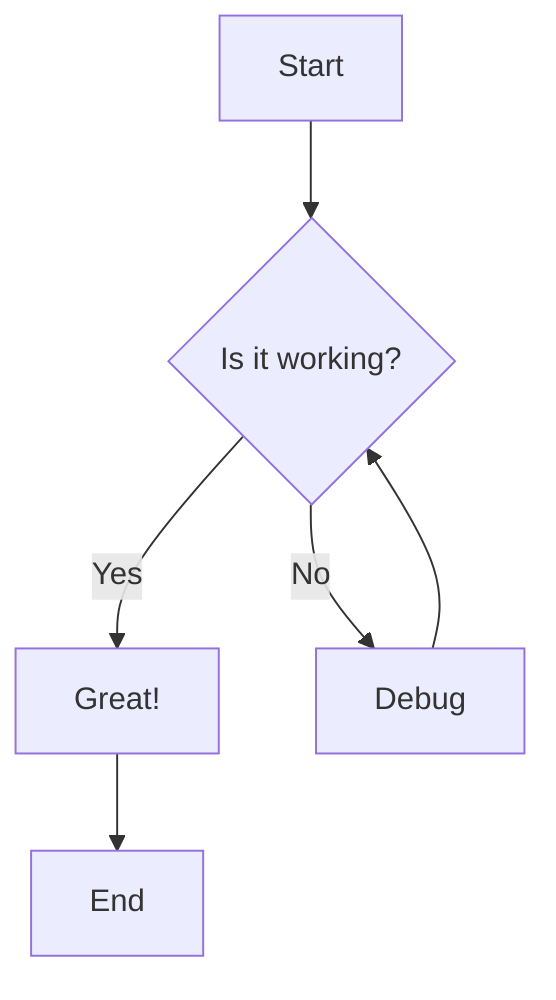
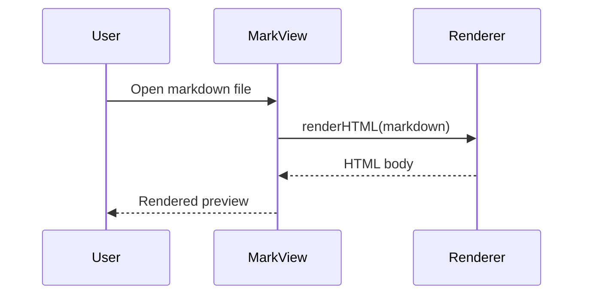
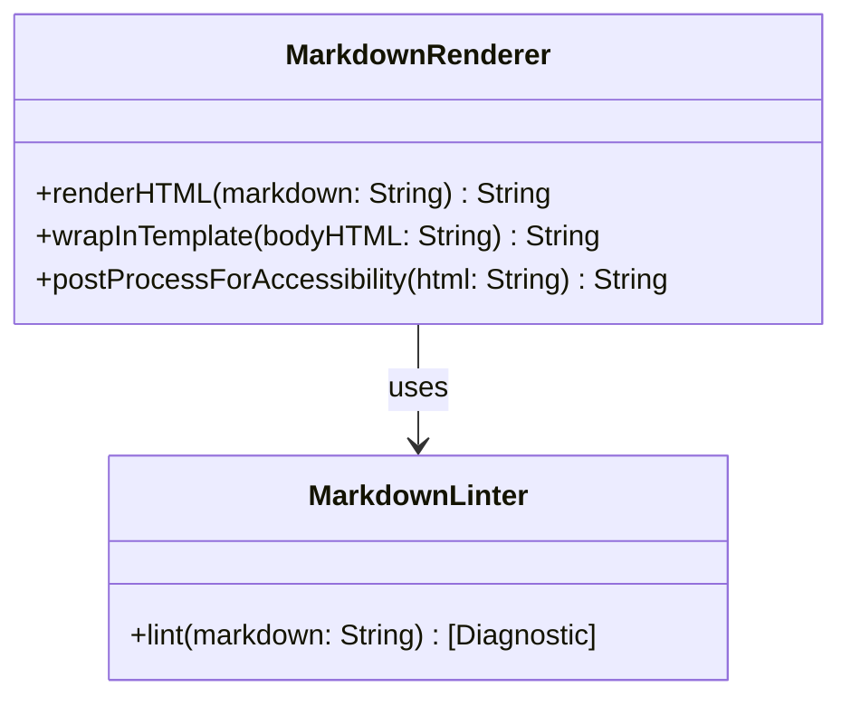
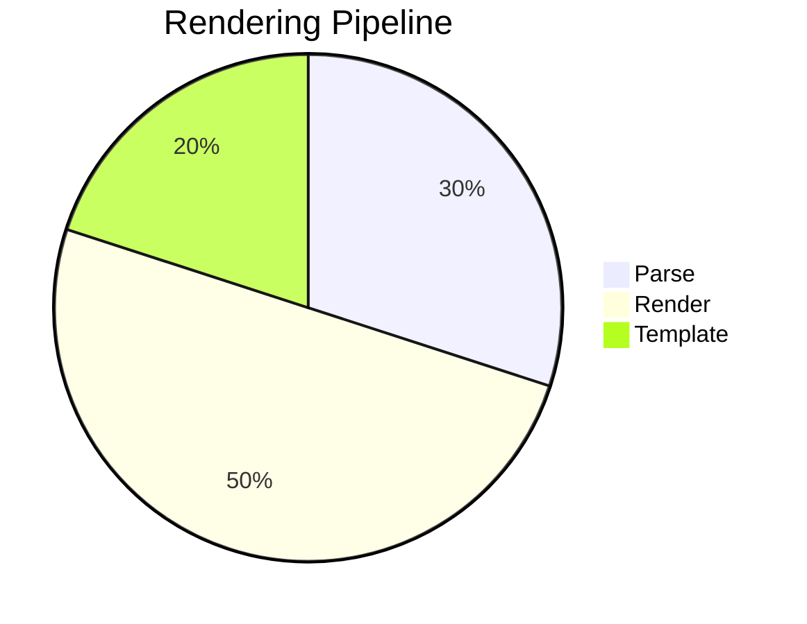
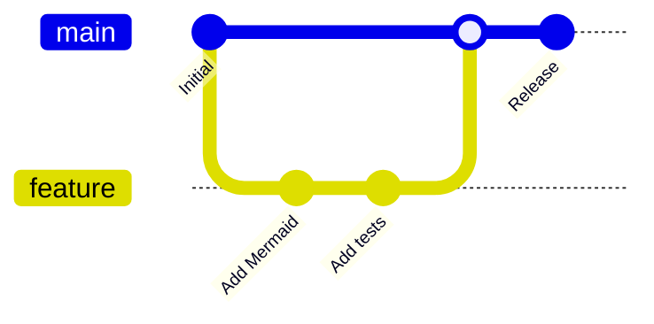
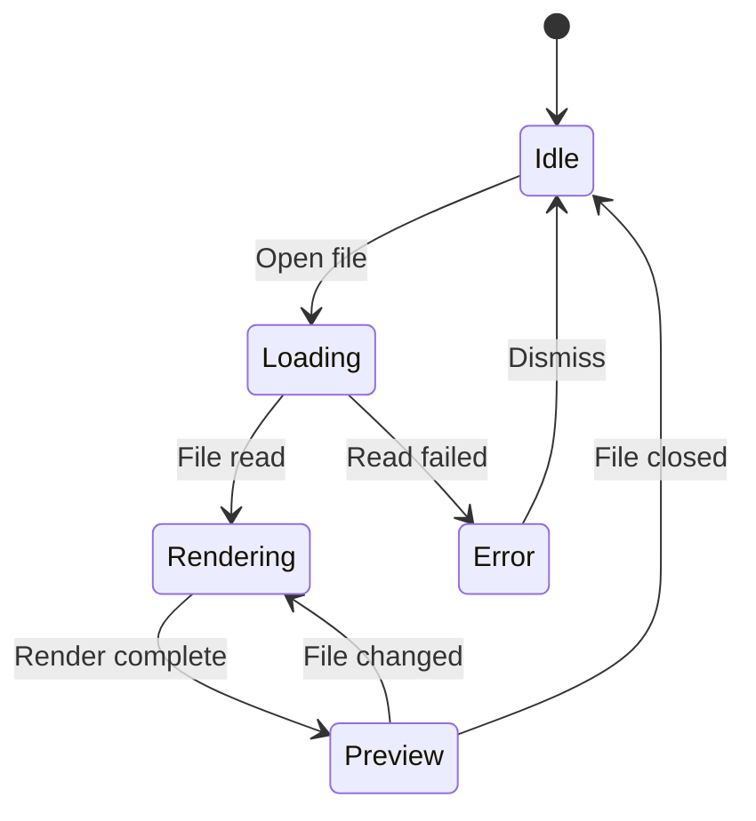
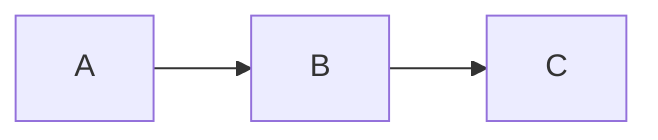

# Mermaid Diagram Test Fixture

This file tests Mermaid diagram rendering. Each fenced code block with the `mermaid` language tag should render as a visual diagram.

## Flowchart

## Sequence Diagram

## Class Diagram

## Pie Chart

## Git Graph

## State Diagram

## Mixed Content

Regular markdown mixed with mermaid:

Here is a paragraph before a diagram.

And a paragraph after, plus some inline `code` and a table:

| Feature | Supported |
|---------|-----------|
| Flowchart | ✅ |
| Sequence | ✅ |
| Class | ✅ |
